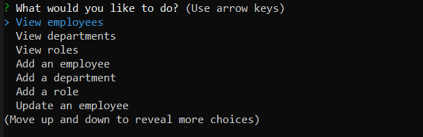

# employee-tracker

## Description
This application allows the user to update, view, and add departments, employees, and roles within a company so the user can organize and plan their business. When the user views the employees, the employee's name, title, salary, department, and manager are also shown. Viewing a specific department will also show all of the employees and their titles within the department. Viewing "roles" shows the department and salary of the role.

A seeds.sql file is provided if the user would like to explore the function of this application. 

## Instructions
1. Run the schema.sql file to create a database. 
2. Enter your mysql password in the app.js file. 
3. Run the app.js file in a node environment. 
4. Press control + c to quit the application. 

## Future Development
This application was an interesting exercise in mysql queries and joins. In the future, I look forward to adding a "delete" function. I may also break up the single js file into multiple files so the code is easier to read. If any bugs are found, please contact me so this application may be improved. 